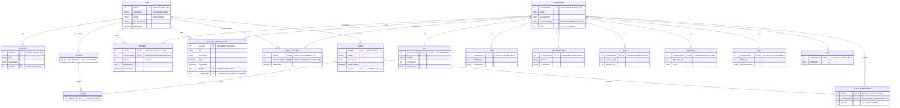

```mermaid
erDiagram
    %% ==================================================
    %% Entities & Attributes
    %% ==================================================

    USER {
        int UserID PK "UserID (Primary Key)"
        string Username "Username (Unique)"
        string Email "Email (Unique)"
        string PasswordHash
        datetime DateJoined
    }

    PROFILE {
        int ProfileID PK "ProfileID (Primary Key)"
        string Bio
        string AvatarURL
        int UserID FK "UserID (Foreign Key)"
    }

    BUILD {
        int BuildID PK "BuildID (Primary Key)"
        string Name
        string Description
        datetime DateCreated
        int UserID FK "UserID (Foreign Key)"
    }

    COMPONENT {
        int ComponentID PK "ComponentID (Primary Key)"
        string Name
        string Manufacturer
        string ComponentType "Discriminator for Specialization"
        int TDP "For PSU Calculator"
    }

    REVIEW {
        int UserID PK, FK "UserID (Composite PK, FK)"
        int ComponentID PK, FK "ComponentID (Composite PK, FK)"
        int Rating "1-5 stars"
        text ReviewText
        datetime DatePosted
    }

    MARKETPLACE_LISTING {
        int ListingID PK "ListingID (Primary Key)"
        string Title
        string Description
        decimal Price
        datetime DateListed
        int UserID FK "UserID (Foreign Key)"
        int ComponentID FK "ComponentID (Foreign Key, Nullable)"
    }

    %% ==================================================
    %% Associative Entities
    %% ==================================================

    BUILD_COMPONENT {
        int BuildID PK, FK "BuildID (Composite PK, FK)"
        int ComponentID PK, FK "ComponentID (Composite PK, FK)"
        int Quantity "e.g., 2 sticks of RAM"
    }

    WISHLIST_ITEM {
        int UserID PK, FK "UserID (Composite PK, FK)"
        int ComponentID PK, FK "ComponentID (Composite PK, FK)"
        datetime DateAdded
    }

    %% ==================================================
    %% EER Specialization Subclasses
    %% ==================================================
    ADMIN {
        int UserID PK, FK "Inherits from USER"
    }

    GUIDE {
        int BuildID PK, FK "Inherits from BUILD"
    }

    CPU {
        int ComponentID PK, FK "Inherits from COMPONENT"
        string Socket
        int CoreCount
        float ClockSpeed
    }
    GPU {
        int ComponentID PK, FK "Inherits from COMPONENT"
        int VRAM_GB
        float ClockSpeed
    }
    MOTHERBOARD {
        int ComponentID PK, FK "Inherits from COMPONENT"
        string Socket
        string FormFactor
    }
    RAM {
        int ComponentID PK, FK "Inherits from COMPONENT"
        int Capacity_GB
        int Speed_MHz
    }
    STORAGE {
        int ComponentID PK, FK "Inherits from COMPONENT"
        int Capacity_GB
        string Type
    }
    PSU {
        int ComponentID PK, FK "Inherits from COMPONENT"
        int Wattage
        string EfficiencyRating
    }
    CASE {
        int ComponentID PK, FK "Inherits from COMPONENT"
        string FormFactor
    }


    %% ==================================================
    %% Relationships (DEFINITIVE VERSION)
    %% ==================================================

    %% --- 1-to-1 Mandatory ---
    USER ||--|| PROFILE : "has"

    %% --- 1-to-Many (Parent participation is optional) ---
    USER ||--o{ BUILD : "creates"
    USER ||--o{ MARKETPLACE_LISTING : "posts"
    ADMIN ||--o{ GUIDE : "curates"

    %% --- Marketplace Relationship (Fully Optional) ---
    COMPONENT }o--o{ MARKETPLACE_LISTING : "is for"

    %% --- Weak Entity Relationships (1-to-Many, Owners are mandatory for the weak entity) ---
    USER ||--o{ REVIEW : "writes"
    COMPONENT ||--o{ REVIEW : "is review for"

    %% --- Associative Entity Relationships (Parent participation is optional) ---
    BUILD ||--o{ BUILD_COMPONENT : "contains"
    COMPONENT ||--o{ BUILD_COMPONENT : "is part of"
    USER ||--o{ WISHLIST_ITEM : "adds to wishlist"
    COMPONENT ||--o{ WISHLIST_ITEM : "is in wishlist"

    %% ==================================================
    %% EER Specialization Relationships (DEFINITIVE VERSION)
    %% ==================================================

    %% --- Partial, Disjoint Specialization (1-to-1 Optional) ---
    USER ||--o| ADMIN : "is a (Role)"
    BUILD ||--o| GUIDE : "is a (Type)"

    %% --- Total, Disjoint Specialization (1-to-1 Mandatory) ---
    COMPONENT ||--|| CPU : "is a"
    COMPONENT ||--|| GPU : "is a"
    COMPONENT ||--|| MOTHERBOARD : "is a"
    COMPONENT ||--|| RAM : "is a"
    COMPONENT ||--|| STORAGE : "is a"
    COMPONENT ||--|| PSU : "is a"
    COMPONENT ||--|| CASE : "is a"
```